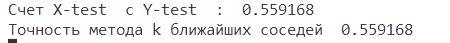
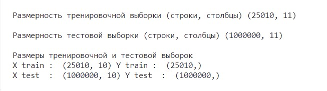
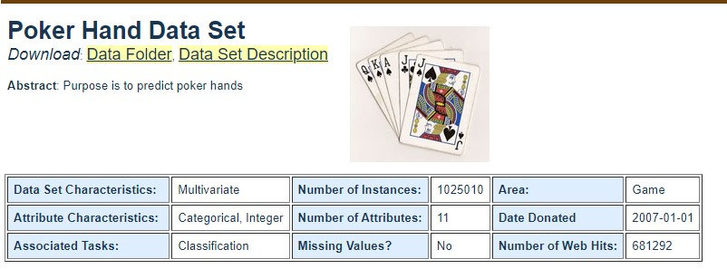
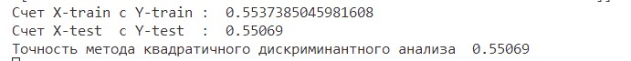
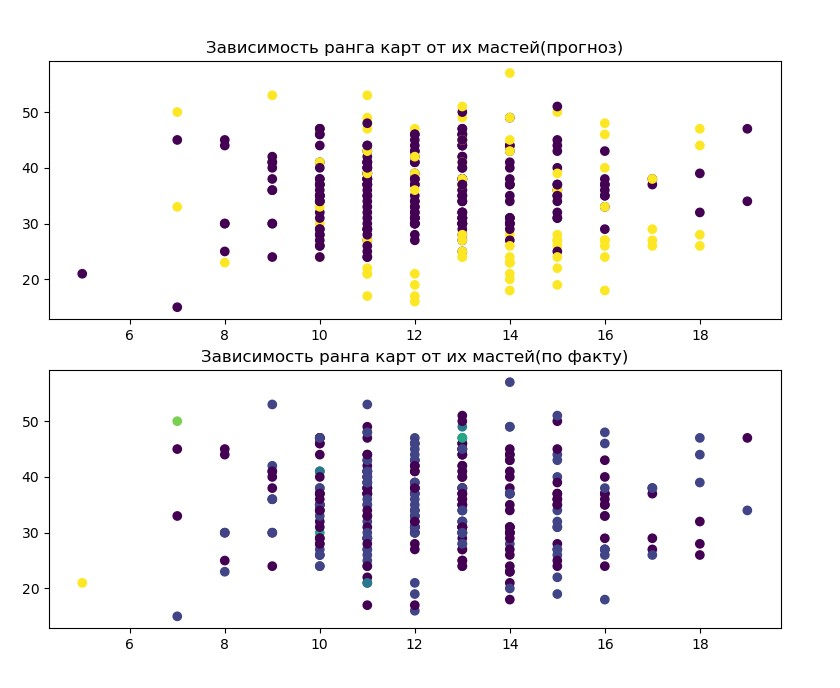
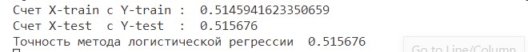
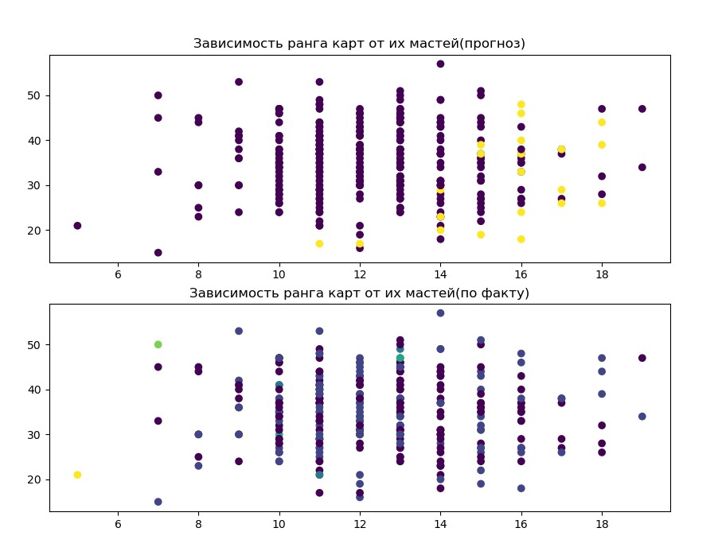
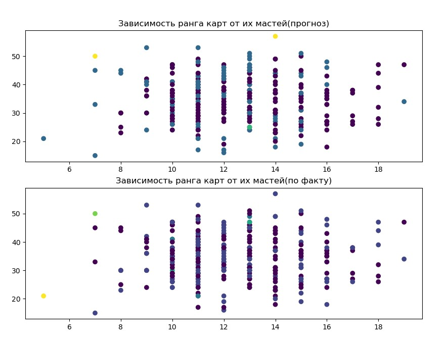

# Отчет по лабораторной работе

1. Для исследования выбраны классификаторы: метод квадратичного дискриминантного анализа, метод логистической регрессии, метод K ближайших соседей.

2. В качестве данных использован датасет Poker Hand Data Set <https://archive.ics.uci.edu/ml/datasets/Poker+Hand>. Набор данных представляет руку игрока в покер из пяти карт и классифицируется по комбинации в ней.

3. Обучение происходит **по всем признакам**.

4. Информация о аттрибутах
 

 

5. Выявим **размерность**.
 

 

6. Информация о **предобработке данных** была получена с сайта датасета, она не требуется.
 
 
 

7. Анализ результатов.

    Есть 10 комбинаций карт в руке  
    - Ничего на руках; не признанная покерная комбинация.  
    - Одна пара; одна пара равных рангов в пределах пяти карт.  
    - Две пары; две пары равных рангов в пределах пяти карт.  
    - Три в своем роде; три равных ранга в пределах пяти карт.  
    - Стрит; пять карт, последовательно ранжированных без пробелов.  
    - Флеш; пять карт одной масти.  
    - Полный дом; пара + тройка разного ранга в своем роде.  
    - Четыре в своем роде; четыре равных ранга в пределах пяти карт.  
    - Прямой флеш; прямой + флеш.  
    - Флеш-рояль; {Туз, король, дама, Валет, Десятка} + флеш.  

    Элементы данных включают 11 столбцов, нечетные столбцы отображают ранг карты, а четные столбцы - их масти, последний столбец - класс  
 

8. Наборы данных матрицы X и вектора y уже разделены на тестовые и тренировочные.  

9. Метод квадратичного дискриминантного анализа 
Матрица ошибок, accuracy score (показывает точность, то есть доля выборок, правильно спрогнозированных значений), а также графики зависимости рангов карт от мастей для прогнзируемых и фактических классификаций. 

  
**Прогнозируемые и фактические значения** 

  

10. Метод логистической регрессии 
Матрица ошибок, accuracy score (показывает точность, то есть доля выборок, правильно спрогнозированных значений), а также графики зависимости рангов карт от мастей для прогнзируемых и фактических классификаций. 

  
**Прогнозируемые и фактические значения** 

  

11. Метод K ближайших соседей 
Матрица ошибок, accuracy score (показывает точность, то есть доля выборок, правильно спрогнозированных значений), а также графики зависимости рангов карт от мастей для прогнзируемых и фактических классификаций. 

  
**Прогнозируемые и фактические значения** 

  

12. Выводы: эффективность методов метрической классификации почти не отличается, хотя на вид при сравнении графиков 300 точек лучше классифицируются методом K ближайших соседей. Для данного вида данных гораздо лучше сработает математический подход, гораздо проще и эффективнее будет просчитать комбинации циклами и условиями в силу дискретности и однозначности природы этих данных.
